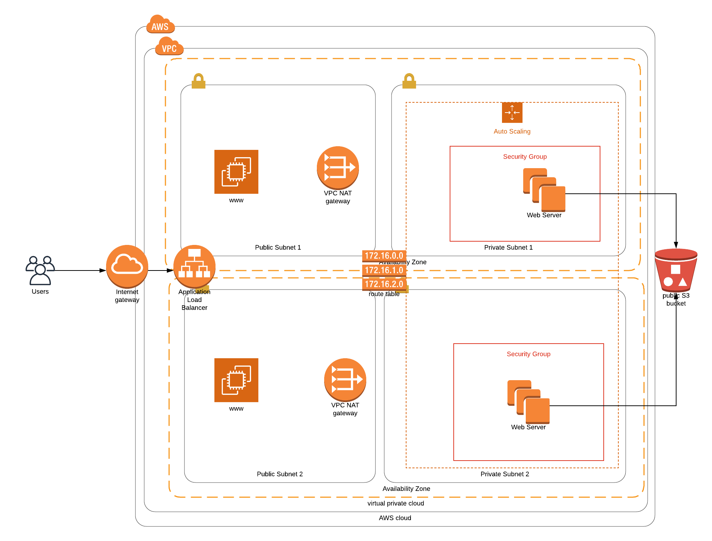

## Description
Deploys Udacity Instagram clone called Udagram.

The following Infrastructure Diagram is implemented

## Setup

Step 1 - Network setup:
Creates network infrastructure in region us-west-2 (Oregon).

aws cloudformation create-stack --stack-name udagram-infra --template-body file://infra.yml --parameters file://infra-params.json --capabilities CAPABILITY_IAM --region us-west-2
or you can use 
./create.sh stack-name infra.yml nw-infra-params.json

Step 2 - Deploy Application Servers:
Deploys on AWS cloud web servers (t2..micro), picks up code (JavaScript and HTML) from S3 Storage and deploys it on the web server.

aws cloudformation create-stack --stack-name udagram-servers --template-body file://appservers.yml --parameters file://appservers-params.json --capabilities CAPABILITY_IAM --region us-west-2
or you can use
./create.sh stack-name appservers.yml appservers-params.json

